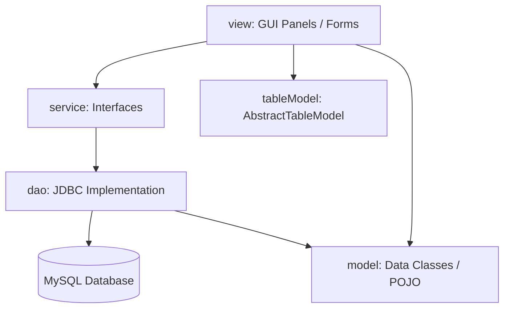

# Dokumentasi Teknis: Human Resource Management System (HRMS)

Dokumentasi ini menjelaskan arsitektur sistem, desain database, alur kerja aplikasi, dan logika bisnis utama dari aplikasi **Human Resource Management System (HRMS)**. Aplikasi ini dirancang sebagai aplikasi desktop menggunakan **Java Swing** dan terintegrasi dengan database **MySQL**.

---

## 1. Spesifikasi Teknologi

Aplikasi HRMS dibangun dengan menggunakan teknologi berikut:
- **Bahasa Pemrograman**: Java (versi JDK 21)
- **Framework GUI**: Java Swing (di-generate menggunakan NetBeans GUI Builder)
- **RDBMS**: MySQL (MariaDB)
- **Konektivitas Database**: JDBC (Java Database Connectivity)
- **Library Pihak Ketiga**:
  - `mysql-connector-j-9.2.0.jar`: Driver konektor MySQL.
  - `LGoodDatePicker-11.2.1.jar`: Komponen pemilih waktu/tanggal interaktif.
  - `jcalendar-1.4.jar`: Pemilih tanggal (date chooser).
  - `jasperreports-6.21.5.jar` (beserta dependensi commons-beanutils, commons-collections4, commons-digester, commons-logging, itext): Library untuk pembuatan laporan cetak PDF/Jasper.

---

## 2. Arsitektur Kode (Design Pattern)

Aplikasi ini mengadopsi pola arsitektur **Model-View-Controller (MVC) & Data Access Object (DAO)** dengan pemisahan tanggung jawab yang jelas dalam package berikut:



### Penjelasan Package:
1. **`config`**:
   - Berisi kelas [Koneksi.java](file:///c:/Users/USer/Documents/NetBeansProjects/HRMS/src/config/Koneksi.java) yang mengatur koneksi JDBC ke MySQL database `db_salary_employee`.
2. **`model`**:
   - Berisi kelas POJO (Plain Old Java Object) yang memetakan kolom database menjadi objek Java (misalnya [EmployeeModel.java](file:///c:/Users/USer/Documents/NetBeansProjects/HRMS/src/model/EmployeeModel.java), [AttendanceModel.java](file:///c:/Users/USer/Documents/NetBeansProjects/HRMS/src/model/AttendanceModel.java)).
3. **`service`**:
   - Berisi interface Java yang mendefinisikan kontrak fungsi bisnis (misalnya `EmployeeService.java`, `AttendanceService.java`).
4. **`dao`**:
   - Implementasi konkret dari package `service` menggunakan JDBC untuk berinteraksi langsung dengan database (misalnya [EmployeeDAO.java](file:///c:/Users/USer/Documents/NetBeansProjects/HRMS/src/DAO/EmployeeDAO.java)).
5. **`tableModel`**:
   - Mengimplementasikan `AbstractTableModel` untuk menjembatani list objek model dengan komponen GUI `JTable` agar data dapat ditampilkan secara dinamis.
6. **`view`**:
   - Berisi form dan panel GUI Swing (`.java` dan file desain NetBeans `.form`).
7. **`report`**:
   - File template laporan compiled Jasper (`.jasper`) yang dipanggil oleh kelas DAO untuk mencetak dokumen/laporan.
8. **`assets`**:
   - Menyimpan gambar, logo, dan ikon yang digunakan di antarmuka aplikasi.

---

## 3. Skema & Struktur Database

Database aplikasi bernama `db_salary_employee`. Berikut adalah daftar tabel utama beserta relasi dan kolom pentingnya:

### Diagram Relasi Tabel (Skema Ringkas)
- Tabel **`employee`** terhubung ke **`departement`** (`iddeptemployee` -> `iddept`) dan **`level`** (`idlevelemployee` -> `idlevel`).
- Tabel **`basicsalary`** terhubung ke **`employee`** (`idemployeebasicsalary` -> `idemployee`).
- Tabel **`attendance`** mencatat data harian kehadiran per karyawan.
- Tabel **`threshold`** (diakses melalui `AttendanceLimit`) mengatur jam batas absensi per departemen.
- Tabel **`salarypermonth`** menampung kalkulasi gaji bulanan karyawan.

### Detail Tabel Utama

#### 1. `employee`
Menyimpan informasi data diri karyawan beserta kredensial login.
- `idemployee` (INT, Primary Key, Auto Increment)
- `nik` (VARCHAR(30)): Nomor Induk Karyawan, digunakan sebagai username login.
- `employeename` (VARCHAR(250))
- `address` (TEXT)
- `phonenumber` (TEXT)
- `iddeptemployee` (INT): Foreign Key ke tabel `departement`.
- `idlevelemployee` (INT): Foreign Key ke tabel `level`.
- `password` (VARCHAR(250)): Kredensial masuk aplikasi.
- `isdeleted` (INT): Soft-delete flag (0 = aktif, 1 = terhapus/keluar).

#### 2. `attendance`
Mencatat log absensi harian karyawan.
- `idattendance` (INT, Primary Key, Auto Increment)
- `idemployee` (INT): Foreign Key ke tabel `employee`.
- `nik` (VARCHAR(30))
- `employeename` (VARCHAR(200))
- `attendancename` (VARCHAR(30)): Jenis absensi (`IN` / `OUT`).
- `attendancetime` (VARCHAR(20)): Format waktu (contoh: `09:00 AM`).
- `islate` (INT): Status terlambat (0 = Tepat Waktu, 1 = Terlambat).
- `totallateperdays` (INT): Total durasi keterlambatan dalam menit pada hari tersebut.
- `isdeleted` (INT)

#### 3. `threshold` (Attendance Limit)
Mengatur aturan waktu kerja default per departemen.
- `idthreshold` (INT, Primary Key, Auto Increment)
- `iddeptthreshold` (INT): ID Departemen.
- `attendancename` (VARCHAR(30)): `IN` atau `OUT`.
- `starttimestr` (VARCHAR(50)): Jam kerja dimulai (misal: `08:00 AM`).
- `endtimestr` (VARCHAR(50)): Jam kerja toleransi keterlambatan (misal: `09:00 AM`).
- `thresholdtimestr` (VARCHAR(50)): Batas akhir absensi/dianggap absen jika lewat dari jam ini (misal: `10:00 AM`).
- `isdeleted` (INT)

#### 4. `overtime`
Mencatat pengajuan atau data lembur karyawan.
- `idovertime` (INT, Primary Key, Auto Increment)
- `idemployeeovertime` (INT): ID Karyawan.
- `overtimereason` (VARCHAR(250))
- `starttime` (VARCHAR(30))
- `endtime` (VARCHAR(30))
- `duration` (INT): Durasi lembur dalam menit.

#### 5. `salarypermonth`
Tabel hasil generasi penggajian bulanan.
- `idsalarypermonth` (INT, Primary Key, Auto Increment)
- `idemployee` (INT): ID Karyawan.
- `nik` (VARCHAR(100))
- `basicsalary` (INT): Gaji pokok.
- `overtimebonus` (INT): Total bonus lembur pada bulan berjalan.
- `cut_late` (INT): Total potongan karena keterlambatan.
- `totalsalarythismonth` (BIGINT): Total gaji bersih (`basicsalary` + `overtimebonus` - `cut_late`).
- `salary_period` (DATE): Periode bulan penggajian.

#### 6. Database View: `vw_attendance`
Merupakan virtual view yang menggabungkan record log absensi harian (`attendance`) ke dalam satu baris per hari per karyawan untuk mempermudah perhitungan, menampilkan waktu check-in (`IN`) dan check-out (`OUT`) secara bersamaan.

---

## 4. Alur Kerja Aplikasi (Application Workflow)

### A. Autentikasi & Otorisasi Pengguna (Role-based Access Control)

Saat aplikasi pertama kali dijalankan, form login ([Login.java](file:///c:/Users/USer/Documents/NetBeansProjects/HRMS/src/view/Login.java)) akan muncul. Pengguna memasukkan **NIK** sebagai username dan **Password**.

Sistem memvalidasi kredensial ke tabel `employee`. Jika sukses, sistem mendeteksi tingkat jabatan (`idlevelemployee`):

1. **Role Employee Biasa (`idlevelemployee = 6`)**:
   Hanya memiliki akses menu terbatas:
   - **Dashboard**: Melihat status umum.
   - **Attendance**: Melakukan absensi masuk (`IN`) dan keluar (`OUT`).
   - **Overtime**: Mencatat data lembur pribadi.
   - **Employees Resign**: Mengajukan pengunduran diri.
   - **Logout**: Keluar dari sesi aplikasi.

2. **Role Management/Admin (`idlevelemployee != 6`, misal GM, HRD, CEO)**:
   Memiliki akses penuh ke semua modul:
   - **Dashboard**: Tampilan awal.
   - **Master Data**:
     - *Employee*: Menambah/mengedit/menghapus karyawan.
     - *Position*: Mengelola jabatan/level.
     - *Departement*: Mengelola departemen organisasi.
     - *Salary*: Menentukan standar gaji pokok karyawan.
     - *Attendance Limit*: Mengatur jam toleransi keterlambatan departemen.
   - **Attendance**: Melihat log absensi seluruh karyawan.
   - **Overtime**: Mengelola lembur karyawan.
   - **Monthly Employees Salary**: Melakukan generate gaji bulanan karyawan.
   - **Employees Resign**: Melihat & mengelola status resign karyawan.
   - **Report**: Mengekspor data laporan absensi, keterlambatan, lembur, dan penggajian.

---

## 5. Logika Bisnis Utama (Core Business Logic)

### A. Aturan Absensi & Penentuan Keterlambatan (`Attendance`)
Proses pencatatan absensi dilakukan pada form [Attendance.java](file:///c:/Users/USer/Documents/NetBeansProjects/HRMS/src/view/Attendance.java) melalui fungsi `createData()`.

1. **Absensi Keluar (`OUT`)**:
   - Sistem memvalidasi apakah waktu absen keluar (`OUT`) dilakukan sebelum jam minimal keluar kerja (`endtimestr` pada `threshold`).
   - Jika karyawan pulang terlalu cepat (sebelum threshold keluar), sistem akan memblokir proses absensi dan menampilkan pesan peringatan.

2. **Absensi Masuk (`IN`)**:
   - Waktu toleransi masuk kantor dibandingkan dengan `endtimestr` (waktu mulai kerja sesungguhnya) dan `thresholdtimestr` (batas akhir boleh absen).
   - **Kondisi 1: Tepat Waktu**
     `Waktu Absen <= Waktu Mulai Kerja`
     - Hasil: `islate = 0`, `totallateperdays = 0`
   - **Kondisi 2: Terlambat (Dalam batas toleransi)**
     `Waktu Mulai Kerja < Waktu Absen < Batas Akhir Absen`
     - Hasil: `islate = 1`
     - Durasi keterlambatan dihitung: `Waktu Absen - Waktu Mulai Kerja` (dalam menit).
   - **Kondisi 3: Di luar batas absensi (Alpa/Tidak Masuk)**
     `Waktu Absen > Batas Akhir Absen`
     - Hasil: Proses absensi dibatalkan, karyawan dianggap tidak hadir.

---

### B. Perhitungan Gaji Bulanan (`EmployeeSalaryPerMonth`)
Kalkulasi gaji bulanan dipicu pada form [EmployeeSalaryPerMonth.java](file:///c:/Users/USer/Documents/NetBeansProjects/HRMS/src/view/EmployeeSalaryPerMonth.java) melalui fungsi `createData()`.

Ketika admin memilih suatu periode tanggal (bulan & tahun) untuk memproses gaji:
1. Sistem mencari semua data karyawan aktif dari tabel `basicsalary` dan `employee`.
2. Untuk setiap karyawan, dihitung akumulasi data dari bulan tersebut:
   - **Potongan Terlambat (`cut_late`)**:
     Diambil dari jumlah menit terlambat pada database view `vw_attendance` untuk bulan tersebut.
     $$\text{Denda Keterlambatan} = \text{Total Menit Terlambat} \times \text{IDR } 5.000$$
   - **Bonus Lembur (`overtimebonus`)**:
     Diambil dari jumlah menit lembur pada tabel `overtime` dengan `isdeleted = 0`.
     $$\text{Bonus Lembur} = \text{Total Menit Lembur} \times \text{IDR } 5.000$$
3. **Perhitungan Gaji Bersih**:
   $$\text{Gaji Bersih Bulanan} = \text{Gaji Pokok} + \text{Bonus Lembur} - \text{Potongan Terlambat}$$
4. Hasil kalkulasi tersebut disimpan ke tabel `salarypermonth`. Jika kalkulasi ulang dilakukan pada periode yang sama, data lama akan ditandai soft-delete (`isdeleted = 1`) dan digantikan dengan record baru.

---

### C. Alur Pengunduran Diri Karyawan (`Resign`)
Proses resign diatur dalam [ResignDAO.java](file:///c:/Users/USer/Documents/NetBeansProjects/HRMS/src/DAO/ResignDAO.java).
Ketika data pengunduran diri karyawan disetujui/ditambahkan ke tabel `resign`:
1. Record baru masuk ke tabel `resign` beserta catatan alasan keluar.
2. Secara otomatis, status karyawan pada tabel `employee` dirubah menjadi tidak aktif dengan melakukan query:
   ```sql
   UPDATE employee SET isdeleted = 1 WHERE employeename = ?
   ```
   Hal ini menjamin karyawan yang resign tidak dapat melakukan login atau terpilih lagi dalam daftar absensi aktif.

---

## 6. Modul Pelaporan (JasperReports)

Laporan-laporan cetak dipicu pada panel [ReportForm.java](file:///c:/Users/USer/Documents/NetBeansProjects/HRMS/src/view/ReportForm.java):
- **Laporan Karyawan**: Menghasilkan daftar seluruh staf aktif via `EmployeeReport.jasper`.
- **Laporan Absensi**: Menampilkan rekap kehadiran karyawan via `Waves_Landscape_1 - Copy.jasper`.
- **Laporan Keterlambatan**: Menampilkan rincian statistik keterlambatan karyawan via `Late.jasper`.
- **Laporan Lembur**: Menampilkan rekap jam lembur karyawan via `Overtime.jasper`.
- **Laporan Gaji**: Menghasilkan slip gaji bulanan via `Salary.jasper`.

Seluruh laporan dijalankan menggunakan `JasperFillManager` dan ditampilkan langsung ke layar melalui `JasperViewer` bawaan library JasperReports.
